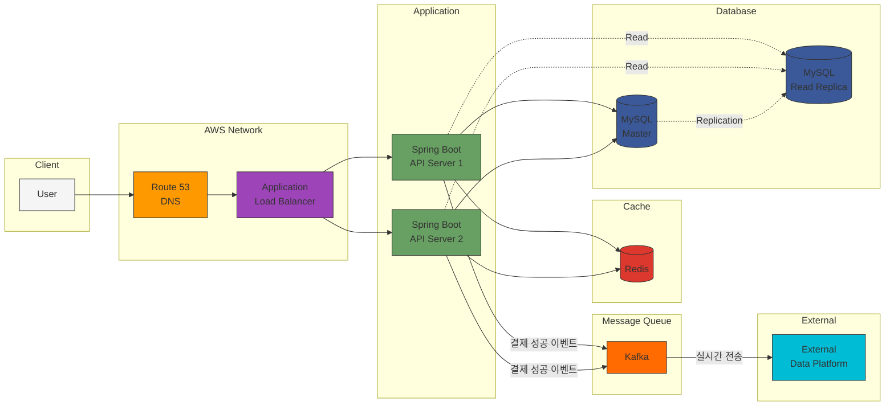

## 인프라구성도

---

---

### 구성요소

| 구성 요소 | 기술 스택 | 주요 역할 |
|---------|---------|----------|
| **DNS** | Route 53 | 도메인 라우팅 및 트래픽 관리 |
| **Load Balancer** | Application Load Balancer (ALB) |  트래픽 분산 및 고가용성 확보 |
| **Application Server** | Spring Boot | REST API 제공 및 비즈니스 로직 처리 |
| **Database (Master)** | MySQL (RDS) | 쓰기 작업 전용 (주문, 결제, 포인트 충전) |
| **Database (Slave)** | MySQL Read Replica | 읽기 작업 전용 (상품 조회, 주문 내역 조회) |
| **Cache** | Redis | 캐싱, 선착순 처리, 세션 관리 |
| **Message Queue** | Kafka | 결제 이벤트 스트리밍 및 데이터 플랫폼 연동 |
| **External System** | Data Platform (Mock/Fake) | 주문 데이터 실시간 수집 및 분석 |

---
