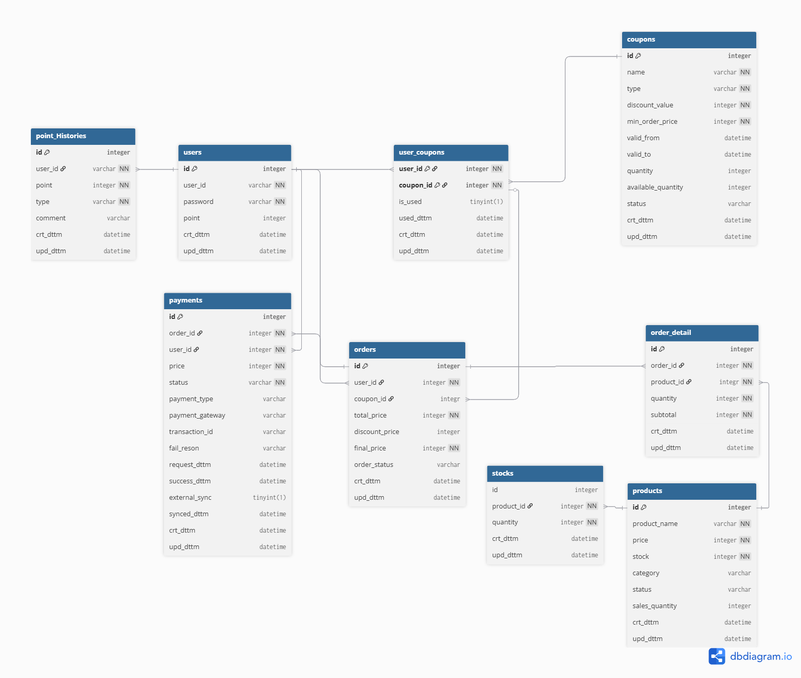

## 📊 ERD 다이어그램



---

```dbml
// ============================================
// 사용자 및 보유포인트 관리
// ============================================
Table users {
  id integer [primary key, increment, note: '식별자']
  account_id varchar(50) [unique, not null, note: '유저 ID']
  password varchar(255) [not null, note: '유저 PWD']
  point  integer [not null, default: 0, note: '보유 포인트']
  crt_dttm datetime [not null, default: `now()`, note: '생성일']
  upd_dttm datetime [note: '변경일']

  indexes {
    account_id [name: 'idx_account_id']
  }
}

// ============================================
// 포인트 사용/충전 내역
// ============================================
Table point_histories  {
  id integer [primary key, increment, note: '식별자']
  user_id integer [not null, ref: > users.id, note: '유저ID FK']
  point integer [not null, note: '포인트']
  type varchar(10) [not null, note: 'USE:사용, CHARGE:충전']
  comment varchar(100) [note: '비고']
  crt_dttm datetime [not null, default: `now()`, note: '생성일']

  indexes {
    user_id [name: 'idx_user_id']
    (user_id, crt_dttm) [name: 'idx_user_date', note: '사용자별 날짜 조회']
    type [name: 'idx_type']
  }
}

// ============================================
// 쿠폰 관리
// ============================================
Table coupons{
  id integer [primary key, increment, note: '식별자']
  name varchar(100) [not null, note: '쿠폰명']
  type varchar(10) [not null, note: '할인타입(AMOUNT:금액, PERCENT:%)']
  discount_value integer [not null, note: '할인 금액 또는 퍼센트']
  min_order_price integer [not null, default: 0, note: '최소 주문 금액']
  valid_from datetime [note: '유효시작일']
  valid_to datetime [note: '유효종료일']
  quantity integer [not null, default: 0, note: '총 발행 수량']
  available_quantity integer [not null, default: 0, note: '남은 수량']
  status varchar(10) [not null, default: 'ACTIVE', note: 'ACTIVE:활성화, INACTIVE:비활성화']
  crt_dttm datetime [not null, default: `now()`, note: '생성일']
  upd_dttm datetime [note: '변경일']

  indexes {
    status [name: 'idx_status']
    (status, valid_from, valid_to) [name: 'idx_valid_coupons', note: '사용 가능 쿠폰 조회']
  }
}

// ============================================
// 사용자 쿠폰현황
// ============================================
Table user_coupons{
  user_id integer [not null, ref: > users.id, note: '유저ID FK']
  coupon_id integer [not null, ref: > coupons.id] 
  status varchar(10) [not null, default: 'AVAILABLE', note: 'AVAILABLE:사용가능, USED:사용완료, EXPIRED:기간만료']
  used_dttm datetime [note: '사용일시']
  expired_dttm datetime [note: '만료일시']
  crt_dttm datetime [not null, default: `now()`, note: '생성일']
  upd_dttm datetime [note: '변경일']

  indexes {
    (user_id, coupon_id) [pk, name: 'pk_user_coupon']
    user_id [name: 'idx_user_id']
    (user_id, status) [name: 'idx_user_status', note: '사용자의 사용 가능 쿠폰 조회']
    status [name: 'idx_status', note: '상태별 쿠폰 통계용']
  }
}

// ============================================
// 상품 관리
// ============================================
Table products {
  id integer [primary key, increment, note: '식별자']
  product_name varchar(200) [not null, note: '상품명']
  price integer [not null, note: '판매가격']
  stock integer [not null, default: 0, note: '현재 재고수량']
  category varchar(50) [note: '카테고리']
  status varchar(20) [not null, default: 'ON_SALE', note: 'ON_SALE:판매중, SOLD_OUT:품절, INACTIVE:판매종료']
  sales_quantity integer [not null, default: 0, note: '누적판매량']
  crt_dttm datetime [not null, default: `now()`, note: '생성일']
  upd_dttm datetime [note: '변경일']
  
  indexes {
    status [name: 'idx_status']
    category [name: 'idx_category']
    (category, status) [name: 'idx_category_status', note: '카테고리별 판매중 상품 조회']
    sales_quantity [name: 'idx_sales_quantity', note: '베스트셀러 조회용']
  }
}

// ============================================
// 상품 재고 관리
// ============================================
Table stocks {
  id integer [primary key, increment, note: '식별자']
  product_id integer [not null, ref: > products.id, note: '상품ID FK']
  quantity integer [not null, note: '입출고 수량 (양수:입고, 음수:출고)']
  stock_type varchar(10) [not null, note: 'IN:입고, OUT:출고']
  reason varchar(100) [note: '입출고 사유']
  crt_dttm datetime [not null, default: `now()`, note: '생성일']
  
  indexes {
    product_id [name: 'idx_product_id']
    (product_id, crt_dttm) [name: 'idx_product_date', note: '상품별 재고 이력 조회']
    stock_type [name: 'idx_stock_type']
  }
}

// ============================================
// 주문 관리
// ============================================
Table orders {
  id integer [primary key, increment, note: '주문번호']
  user_id integer [not null, ref: > users.id, note: '유저ID FK']
  coupon_id integer [null, note: '사용한 쿠폰ID']
  total_price integer [not null, note: '총 주문 금액 (할인 전)']
  discount_price integer [not null, default: 0, note: '할인 금액']
  final_price integer [not null, note: '최종 결제 금액 (할인 후)']
  order_status varchar(20) [not null, default: 'PENDING', note: 'PENDING:대기, COMPLETED:완료, CANCELED:취소']
  crt_dttm datetime [not null, default: `now()`, note: '생성일']
  upd_dttm datetime [note: '변경일']
  
  indexes {
    user_id [name: 'idx_user_id']
    order_status [name: 'idx_order_status']
    (user_id, order_status) [name: 'idx_user_status', note: '사용자별 주문 상태 조회']
    (user_id, crt_dttm) [name: 'idx_user_date', note: '사용자별 주문 이력 조회']
    (user_id, coupon_id) [name: 'idx_user_coupon']
  }
}

// ============================================
// 주문 상세내역
// ============================================
Table order_detail {
  id integer [primary key, increment, note: '식별자']
  order_id integer [not null, ref: > orders.id, note: '주문번호 FK']
  product_id integer [not null, ref: > products.id, note: '상품번호 FK']
  quantity integer [not null, note: '주문수량']
  unit_price integer [not null, note: '단가 (주문 당시 가격)']
  subtotal integer [not null, note: '소계 (unit_price × quantity)']
  crt_dttm datetime [not null, default: `now()`, note: '생성일']
  upd_dttm datetime [note: '변경일']
  
  indexes {
    order_id [name: 'idx_order_id']
    product_id [name: 'idx_product_id']
  }
}

// ============================================
// 결제 관리
// ============================================
Table payments {
  id integer [primary key, increment, note: '식별자']
  order_id integer [not null, ref: > orders.id, note: '주문ID FK']
  user_id integer [not null, ref: > users.id, note: '유저ID FK']
  price integer [not null, note: '결제 금액']
  status varchar(20) [not null, default: 'PENDING', note: 'PENDING:대기, COMPLETED:완료, CANCELED:취소, FAILED:실패']
  payment_type varchar(20) [note: '결제 수단 (CARD, BANK_TRANSFER, POINT 등)']
  payment_gateway varchar(50) [note: '결제 게이트웨이 (PG사)']
  transaction_id varchar(100) [unique, note: '거래 ID (PG사 제공)']
  fail_reason varchar(500) [note: '실패 사유']
  request_dttm datetime [note: '결제 요청일시']
  success_dttm datetime [note: '결제 성공일시']
  external_sync boolean [not null, default: false, note: '외부 시스템 동기화 여부 (MySQL: TINYINT(1))']
  synced_dttm datetime [note: '동기화일시']
  crt_dttm datetime [not null, default: `now()`, note: '생성일']
  upd_dttm datetime [note: '변경일']
  
  indexes {
    order_id [name: 'idx_order_id']
    user_id [name: 'idx_user_id']
    status [name: 'idx_status']
    transaction_id [name: 'idx_transaction_id']
    (user_id, status) [name: 'idx_user_status', note: '사용자별 결제 상태 조회']
    external_sync [name: 'idx_external_sync', note: '미동기 건 조회용']
  }
}
  ```