```mermaid
graph LR
    subgraph "Client"
        USER[User]
    end

    subgraph "AWS Network"
        R53[Route 53<br/>DNS]
        ALB[Application<br/>Load Balancer]
    end

    subgraph "Application"
        API1[Spring Boot<br/>API Server 1]
        API2[Spring Boot<br/>API Server 2]
    end

    subgraph "Database"
        RDS_MASTER[(MySQL<br/>Master)]
        RDS_SLAVE[(MySQL<br/>Read Replica)]
    end

    subgraph "Cache"
        REDIS[(Redis)]
    end

    subgraph "Message Queue"
        KAFKA[Kafka]
    end

    subgraph "External"
        DATA_PLATFORM[External<br/>Data Platform]
    end

    USER --> R53
    R53 --> ALB
    ALB --> API1
    ALB --> API2
    
    API1 --> RDS_MASTER
    API2 --> RDS_MASTER
    API1 -.Read.-> RDS_SLAVE
    API2 -.Read.-> RDS_SLAVE
    
    RDS_MASTER -.Replication.-> RDS_SLAVE
    
    API1 --> REDIS
    API2 --> REDIS
    
    API1 -->|결제 성공 이벤트| KAFKA
    API2 -->|결제 성공 이벤트| KAFKA
    
    KAFKA -->|실시간 전송| DATA_PLATFORM

    style USER fill:#f5f5f5,stroke:#333
    style R53 fill:#ff9900,stroke:#333
    style ALB fill:#9d44b8,stroke:#333
    style API1 fill:#68a063,stroke:#333
    style API2 fill:#68a063,stroke:#333
    style RDS_MASTER fill:#3b5998,stroke:#333
    style RDS_SLAVE fill:#3b5998,stroke:#333
    style REDIS fill:#dc382d,stroke:#333
    style KAFKA fill:#ff6b00,stroke:#333
    style DATA_PLATFORM fill:#00bcd4,stroke:#333
```

## 🧩 인프라구성도

---

---

### 구성요소

| 구성 요소 | 기술 스택 | 주요 역할 |
|---------|---------|----------|
| **DNS** | Route 53 | 도메인 라우팅 및 트래픽 관리 |
| **Load Balancer** | Application Load Balancer (ALB) |  트래픽 분산 및 고가용성 확보 |
| **Application Server** | Spring Boot | REST API 제공 및 비즈니스 로직 처리 |
| **Database (Master)** | MySQL (RDS) | 쓰기 작업 전용 (주문, 결제, 포인트 충전) |
| **Database (Slave)** | MySQL Read Replica | 읽기 작업 전용 (상품 조회, 주문 내역 조회) |
| **Cache** | Redis | 캐싱, 선착순 처리, 세션 관리 |
| **Message Queue** | Kafka | 결제 이벤트 스트리밍 및 데이터 플랫폼 연동 |
| **External System** | Data Platform (Mock/Fake) | 주문 데이터 실시간 수집 및 분석 |

---
